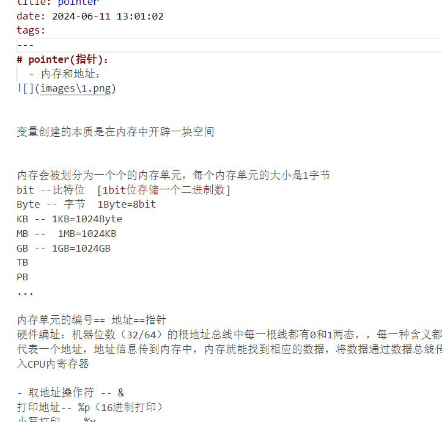

# pointer(指针)：
  - 内存和地址：

变量创建的本质是在内存中开辟一块空间

内存会被划分为一个个的内存单元，每个内存单元的大小是1字节
bit --比特位  [1bit位存储一个二进制数]
Byte -- 字节  1Byte=8bit
KB -- 1KB=1024Byte
MB --  1MB=1024KB
GB -- 1GB=1024GB
TB
PB
...

内存单元的编号== 地址==指针
硬件编址：机器位数（32/64）的根地址总线中每一根线都有0和1两态，，每一种含义都代表一个地址，地址信息传到内存中，内存就能找到相应的数据，将数据通过数据总线传入CPU内寄存器

- 取地址操作符 -- &
打印地址-- %p（16进制打印）
小写打印 -- %x
 

  

[def]: 1.png